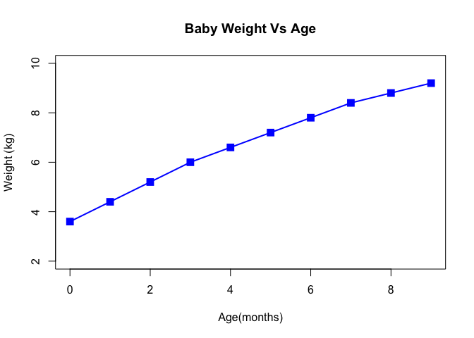
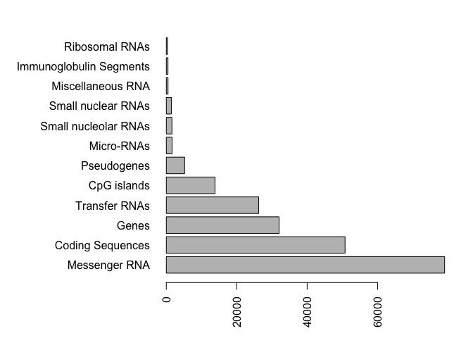
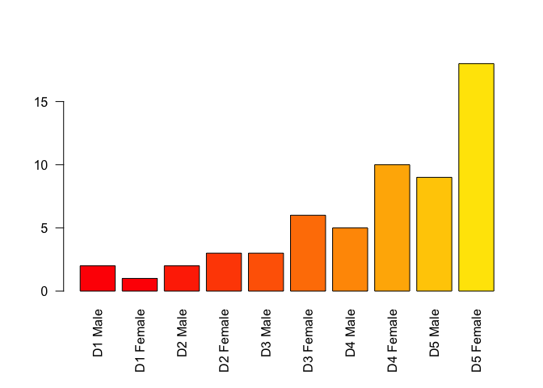
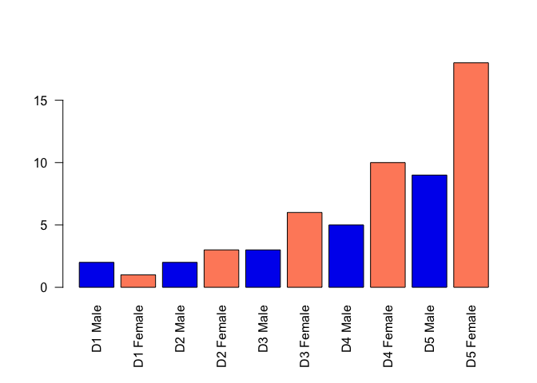
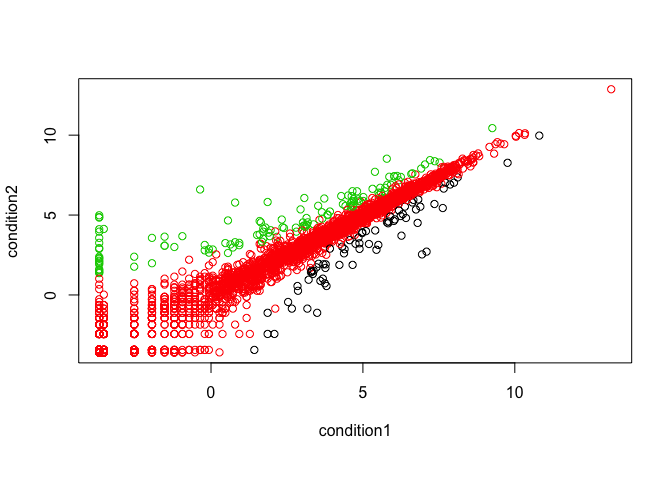

Class05 Graphics and Plots with R
================
Gidsela luna
January 25th, 2019

``` r
#[website](https://rmarkdown.rstudio.com/articles_report_from_r_script.html)

weight<-read.table("bimm143_05_rstats/weight_chart.txt",header=TRUE)
# header argument will make the first role be in the variables 

plot(weight,pch=15,type="o",cex=1.5,lwd=2,ylim=c(2,10), xlab="Age(months)", ylab="Weight (kg)", main="Baby Weight Vs Age", col=4)
```



``` r
# type p is for points, type l is for lines and o is for overplotted?
#changing the pch from 

# 2B barplot
counts<-read.table("bimm143_05_rstats/feature_counts.txt",header=TRUE, sep="\t")
# to overcome the awkward spacing, use the sep="\t"
par(mar=c(4.1,12.1,2.1,2.1))
barplot(counts$Count,names.arg=counts$Feature,las=2,horiz=TRUE)
```



``` r
#change the las from a default 1 value to a 2
# par function controls flobal parameters affecting all plots in the current plot area
# to restore the old settings, use the broom to erase all the plots. It will reset the par

#Section 3:Using Colors in Plots 
mp<-read.table("bimm143_05_rstats/male_female_counts.txt",sep="\t",header=TRUE)
par(mar=c(6.1,4.1,4.1,2.1))
barplot(mp$Count,names.arg=mp$Sample,las=2,col=rainbow(60))
```



``` r
barplot(mp$Count,names.arg=mp$Sample,las=2,col=c("blue2","salmon1"))
```



``` r
# you can also use rainbow(10) or rainbow(nrow(mp))

#Section 3B: Coloring by value 
genes<-read.table("bimm143_05_rstats/up_down_expression.txt",header=TRUE)
#How many genes are going up? down? unchanged 
table(genes$State)
```

    ## 
    ##       down unchanging         up 
    ##         72       4997        127

``` r
#what is the number of genes?
nrow(genes)
```

    ## [1] 5196

``` r
#plot the conditions against each other, seperate the color based on up or down 

plot(genes$Condition1,genes$Condition2, col=genes$State,xlab="condition1",ylab="condition2")
```



``` r
palette(c("blue","gray","red"))
levels(genes$State)
```

    ## [1] "down"       "unchanging" "up"
