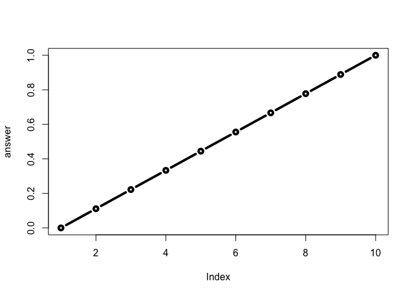

Class 6 R Functions
================
Gidsela Luna
January 25, 2019

File Reading
------------

Here we try to use **read.table** and friends to input some data into R you can view any function in the console without any parenthesis

Lets insert a code chunk (insert using option-commdand-I)

``` r
read.table("https://bioboot.github.io/bggn213_S18/class-material/test1.txt",header=TRUE,sep=",")
```

    ##   Col1 Col2 Col3
    ## 1    1    2    3
    ## 2    4    5    6
    ## 3    7    8    9
    ## 4    a    b    c

``` r
read.table("https://bioboot.github.io/bggn213_S18/class-material/test2.txt",header=TRUE,sep="$")
```

    ##   Col1 Col2 Col3
    ## 1    1    2    3
    ## 2    4    5    6
    ## 3    7    8    9
    ## 4    a    b    c

``` r
data3<-read.table("https://bioboot.github.io/bggn213_S18/class-material/test3.txt",sep="")
data3
```

    ##   V1 V2 V3
    ## 1  1  6  a
    ## 2  2  7  b
    ## 3  3  8  c
    ## 4  4  9  d
    ## 5  5 10  e

what is a function?
-------------------

name, arguments, body
---------------------

My first function

``` r
add <- function(x, y=1) {
 # Sum the input x and y
 x + y
}
```

Lets use the **add()** function

``` r
add(1)
```

    ## [1] 2

``` r
add(1,5)
```

    ## [1] 6

``` r
add(c(1,2,3,4))
```

    ## [1] 2 3 4 5

``` r
add(c(1,2,3,4),4)
```

    ## [1] 5 6 7 8

``` r
#add(1,2,3)
```

``` r
#add(x=1,y="b")
```

``` r
rescale <- function(x) {
 rng <-range(x)
 (x - rng[1]) / (rng[2] - rng[1])
}
```

``` r
rescale(1:10)
```

    ##  [1] 0.0000000 0.1111111 0.2222222 0.3333333 0.4444444 0.5555556 0.6666667
    ##  [8] 0.7777778 0.8888889 1.0000000

``` r
rescale( c(1,2,NA,3,10) )
```

    ## [1] NA NA NA NA NA

``` r
x=range( c(1,2,NA,3,10) )
x
```

    ## [1] NA NA

``` r
rescale2 <- function(x) {
 rng <-range(x,na.rm=TRUE)
 (x - rng[1]) / (rng[2] - rng[1])
}
```

``` r
x=rescale2( c(1,2,NA,3,10) )
x
```

    ## [1] 0.0000000 0.1111111        NA 0.2222222 1.0000000

``` r
#rescale2(c(1,10),"string") 
```

``` r
rescale3 <- function(x, na.rm=TRUE, plot=FALSE) {
 if(na.rm) {
 rng <-range(x, na.rm=na.rm)
 } else {
 rng <-range(x)
 }
 print("Hello")
 answer <- (x - rng[1]) / (rng[2] - rng[1])
 print("is it me you are looking for?")
 if(plot) {
 plot(answer, typ="b", lwd=4)
   print("dont sing again")
 }
 print("I can see it in ...")
}
```

``` r
rescale3(1:10,plot=TRUE)
```

    ## [1] "Hello"
    ## [1] "is it me you are looking for?"



    ## [1] "dont sing again"
    ## [1] "I can see it in ..."

using the bio3d package
-----------------------

``` r
library(bio3d)
```

``` r
pdb<-read.pdb("1hbs")
```

    ##   Note: Accessing on-line PDB file

``` r
# what is this PDB sort of thing?
pdb
```

    ## 
    ##  Call:  read.pdb(file = "1hbs")
    ## 
    ##    Total Models#: 1
    ##      Total Atoms#: 9104,  XYZs#: 27312  Chains#: 8  (values: A B C D E F G H)
    ## 
    ##      Protein Atoms#: 8760  (residues/Calpha atoms#: 1148)
    ##      Nucleic acid Atoms#: 0  (residues/phosphate atoms#: 0)
    ## 
    ##      Non-protein/nucleic Atoms#: 344  (residues: 8)
    ##      Non-protein/nucleic resid values: [ HEM (8) ]
    ## 
    ##    Protein sequence:
    ##       VLSPADKTNVKAAWGKVGAHAGEYGAEALERMFLSFPTTKTYFPHFDLSHGSAQVKGHGK
    ##       KVADALTNAVAHVDDMPNALSALSDLHAHKLRVDPVNFKLLSHCLLVTLAAHLPAEFTPA
    ##       VHASLDKFLASVSTVLTSKYRVHLTPVEKSAVTALWGKVNVDEVGGEALGRLLVVYPWTQ
    ##       RFFESFGDLSTPDAVMGNPKVKAHGKKVLGAFSDGLAHLDNLKGT...<cut>...HKYH
    ## 
    ## + attr: atom, xyz, seqres, helix, calpha,
    ##         remark, call

``` r
library(bio3d)
s1 <- read.pdb("4AKE") # kinase with drug
```

    ##   Note: Accessing on-line PDB file

``` r
s2 <- read.pdb("1AKE") # kinase no drug
```

    ##   Note: Accessing on-line PDB file
    ##    PDB has ALT records, taking A only, rm.alt=TRUE

``` r
s3 <- read.pdb("1E4Y") # kinase with drug
```

    ##   Note: Accessing on-line PDB file

``` r
s1.chainA <- trim.pdb(s1, chain="A", elety="CA")
s2.chainA <- trim.pdb(s2, chain="A", elety="CA")
s3.chainA <- trim.pdb(s3, chain="A", elety="CA")
s1.b <- s1.chainA$atom$b
s2.b <- s2.chainA$atom$b
s3.b <- s3.chainA$atom$b
plotb3(s1.b, sse=s1.chainA, typ="l", ylab="Bfactor")
```


``` r
plotb3(s2.b, sse=s2.chainA, typ="l", ylab="Bfactor")
```


``` r
plotb3(s3.b, sse=s3.chainA, typ="l", ylab="Bfactor")
```


