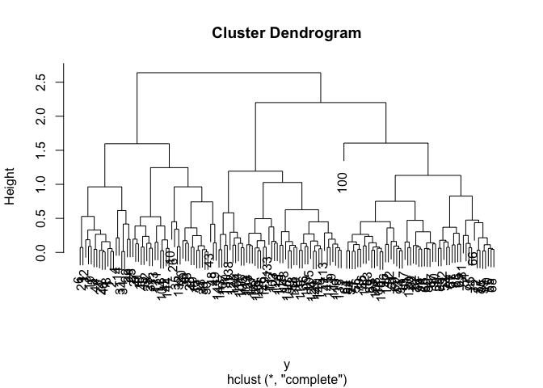
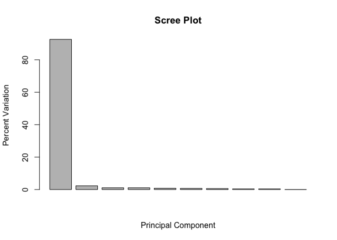

class08 Introduction to machine learning for Bioinformatics (Part 1)
================

``` r
x <- read.csv("https://bioboot.github.io/bggn213_f17/class-material/UK_foods.csv")
```

``` r
#how many rows are there for this file?
nrow(x)
```

    ## [1] 17

``` r
ncol(x)
```

    ## [1] 5

``` r
# How to view the first 6 rows?
head(x,6)
```

    ##                X England Wales Scotland N.Ireland
    ## 1         Cheese     105   103      103        66
    ## 2  Carcass_meat      245   227      242       267
    ## 3    Other_meat      685   803      750       586
    ## 4           Fish     147   160      122        93
    ## 5 Fats_and_oils      193   235      184       209
    ## 6         Sugars     156   175      147       139

``` r
dim(x)
```

    ## [1] 17  5

``` r
#how to eliminate the the uneccesary column 

rownames(x)<-x[,1]
x<-x[,-1]
head(x)
```

    ##                England Wales Scotland N.Ireland
    ## Cheese             105   103      103        66
    ## Carcass_meat       245   227      242       267
    ## Other_meat         685   803      750       586
    ## Fish               147   160      122        93
    ## Fats_and_oils      193   235      184       209
    ## Sugars             156   175      147       139

``` r
#what are the new dimensions for X?
dim(x)
```

    ## [1] 17  4

``` r
#what is a more safer and efficient way to do this 
x2<-x <- read.csv("https://bioboot.github.io/bggn213_f17/class-material/UK_foods.csv",row.names = 1)
x2
```

    ##                     England Wales Scotland N.Ireland
    ## Cheese                  105   103      103        66
    ## Carcass_meat            245   227      242       267
    ## Other_meat              685   803      750       586
    ## Fish                    147   160      122        93
    ## Fats_and_oils           193   235      184       209
    ## Sugars                  156   175      147       139
    ## Fresh_potatoes          720   874      566      1033
    ## Fresh_Veg               253   265      171       143
    ## Other_Veg               488   570      418       355
    ## Processed_potatoes      198   203      220       187
    ## Processed_Veg           360   365      337       334
    ## Fresh_fruit            1102  1137      957       674
    ## Cereals                1472  1582     1462      1494
    ## Beverages                57    73       53        47
    ## Soft_drinks            1374  1256     1572      1506
    ## Alcoholic_drinks        375   475      458       135
    ## Confectionery            54    64       62        41

``` r
barplot(as.matrix(x2),beside=TRUE,col=rainbow(nrow(x)))
```


``` r
barplot(as.matrix(x2),beside=FALSE,col=rainbow(nrow(x)))
```


``` r
pairs(x, col=rainbow(10), pch=16)
```


### PCA

``` r
pca<-prcomp(t(x2))
summary(pca)
```

    ## Importance of components:
    ##                             PC1      PC2      PC3       PC4
    ## Standard deviation     324.1502 212.7478 73.87622 4.189e-14
    ## Proportion of Variance   0.6744   0.2905  0.03503 0.000e+00
    ## Cumulative Proportion    0.6744   0.9650  1.00000 1.000e+00

``` r
plot(pca$x[,1], pca$x[,2], xlab="PC1", ylab="PC2", xlim=c(-270,500))
text(pca$x[,1], pca$x[,2], colnames(x),col=c("orange","red","blue","darkgreen"))
```


``` r
par(mar=c(10, 3, 0.35, 0))
barplot( pca$rotation[,1], las=2 )
```


### Hierarchial Clustering

``` r
tmp<-c(rnorm(30,-3), rnorm(30,3))
#mean of -3 or 3, for 30 random numbers for each 
x<-cbind(x=tmp, y=rev(tmp))
plot(x)
```


``` r
km<-kmeans(x,center=2,nstart=20)
print(km)
```

    ## K-means clustering with 2 clusters of sizes 30, 30
    ## 
    ## Cluster means:
    ##           x         y
    ## 1  3.207043 -2.871280
    ## 2 -2.871280  3.207043
    ## 
    ## Clustering vector:
    ##  [1] 2 2 2 2 2 2 2 2 2 2 2 2 2 2 2 2 2 2 2 2 2 2 2 2 2 2 2 2 2 2 1 1 1 1 1
    ## [36] 1 1 1 1 1 1 1 1 1 1 1 1 1 1 1 1 1 1 1 1 1 1 1 1 1
    ## 
    ## Within cluster sum of squares by cluster:
    ## [1] 69.09559 69.09559
    ##  (between_SS / total_SS =  88.9 %)
    ## 
    ## Available components:
    ## 
    ## [1] "cluster"      "centers"      "totss"        "withinss"    
    ## [5] "tot.withinss" "betweenss"    "size"         "iter"        
    ## [9] "ifault"

``` r
#size

km$size
```

    ## [1] 30 30

``` r
plot(x,col=km$cluster)
# col represents the default plotting color 
points(km$centers,col="blue",pch=15,cex=3)
```


``` r
# here you are adding the point for the center and altering the graphical parametesr 
```

two types of hierachial cluster
===============================

bottom up, each point starts at its own cluster to eventually just one
======================================================================

hierachial clustering in R
==========================

``` r
 # First we need to calculate point (dis)similarity
#   as the Euclidean distance between observations
dist_matrix <- dist(x)
# The hclust() function returns a hierarchical
#  clustering model
hc <- hclust(d = dist_matrix)
# the print method is not so useful here
hc
```

    ## 
    ## Call:
    ## hclust(d = dist_matrix)
    ## 
    ## Cluster method   : complete 
    ## Distance         : euclidean 
    ## Number of objects: 60

``` r
plot(hc)
abline(h=6,col="red")
```


``` r
grp2<-cutree(hc,h=6)
```

``` r
plot(x,col=grp2)
```


``` r
plot(hc)
abline(h=2.5,col="blue")
```


``` r
grp6<-cutree(hc,h=2.5)
table(grp6)
```

    ## grp6
    ##  1  2  3  4  5  6 
    ## 13 11  6 11 13  6

we can also use k=groups as an argument to cutree!
==================================================

``` r
cutree(hc,k=3)
```

    ##  [1] 1 1 1 1 1 1 1 1 1 1 1 1 1 1 1 1 1 1 1 1 1 1 1 1 1 1 1 1 1 1 2 2 3 3 3
    ## [36] 3 3 3 2 3 2 3 3 2 2 2 3 3 3 3 2 3 2 3 2 3 3 3 2 3

``` r
d<-dist_matrix
hc.complete <- hclust(d, method="complete")
plot(hc.complete)
```


``` r
hc.average  <- hclust(d, method="average")
plot(hc.average)
```


``` r
hc.single   <- hclust(d, method="single")
plot(hc.single)
```


``` r
# Step 1. Generate some example data for clustering
x <- rbind(
  matrix(rnorm(100, mean=0, sd = 0.3), ncol = 2),   # c1
  matrix(rnorm(100, mean = 1, sd = 0.3), ncol = 2), # c2
  matrix(c(rnorm(50, mean = 1, sd = 0.3),           # c3
           rnorm(50, mean = 0, sd = 0.3)), ncol = 2))
colnames(x) <- c("x", "y")
# Step 2. Plot the data without clustering
plot(x)
```


``` r
# Step 3. Generate colors for known clusters
#         (just so we can compare to hclust results)
col <- as.factor( rep(c("c1","c2","c3"), each=50) )
plot(x, col=col)
```


``` r
#here we are doing tradiontal hierachial clustering 
y<-dist(x)
hc2<-hclust(y)

plot(hc2)
```



``` r
grps2<-cutree(hc2,k=3)
plot(x,col=grps2)
```


``` r
mydata <- read.csv("https://tinyurl.com/expression-CSV",
                        row.names=1)
head(mydata)
```

    ##        wt1 wt2  wt3  wt4 wt5 ko1 ko2 ko3 ko4 ko5
    ## gene1  439 458  408  429 420  90  88  86  90  93
    ## gene2  219 200  204  210 187 427 423 434 433 426
    ## gene3 1006 989 1030 1017 973 252 237 238 226 210
    ## gene4  783 792  829  856 760 849 856 835 885 894
    ## gene5  181 249  204  244 225 277 305 272 270 279
    ## gene6  460 502  491  491 493 612 594 577 618 638

``` r
#NOTE: prcomp() expects the samples to be rows and genes to be columns so we need to first transpose the matrix with the t() function!
pca<-prcomp(t(mydata),scale=TRUE)
summary(pca)
```

    ## Importance of components:
    ##                           PC1    PC2     PC3     PC4     PC5     PC6
    ## Standard deviation     9.6237 1.5198 1.05787 1.05203 0.88062 0.82545
    ## Proportion of Variance 0.9262 0.0231 0.01119 0.01107 0.00775 0.00681
    ## Cumulative Proportion  0.9262 0.9493 0.96045 0.97152 0.97928 0.98609
    ##                            PC7     PC8     PC9      PC10
    ## Standard deviation     0.80111 0.62065 0.60342 3.348e-15
    ## Proportion of Variance 0.00642 0.00385 0.00364 0.000e+00
    ## Cumulative Proportion  0.99251 0.99636 1.00000 1.000e+00

make our first PCA
==================

``` r
dim(pca$x)
```

    ## [1] 10 10

``` r
plot(pca$x[,1],pca$x[,2], xlab="PC1", ylab="PC2")
```


``` r
pca.var <- pca$sdev^2
pca.var.per <- round(pca.var/sum(pca.var)*100, 1)
pca.var.per
```

    ##  [1] 92.6  2.3  1.1  1.1  0.8  0.7  0.6  0.4  0.4  0.0

``` r
pca.var <- pca$sdev^2
pca.var.per <- round(pca.var/sum(pca.var)*100, 1)
barplot(pca.var.per, main="Scree Plot",
        xlab="Principal Component", ylab="Percent Variation")
```



``` r
colvec <- as.factor( substr( colnames(mydata), 1, 2) )
plot(pca$x[,1], pca$x[,2], col=colvec, pch=16,
     xlab=paste0("PC1 (", pca.var.per[1], "%)"),
     ylab=paste0("PC2 (", pca.var.per[2], "%)"))
```


``` r
  plot(pca$x[,1], pca$x[,2], col=colvec, pch=16,
       xlab=paste0("PC1 (", pca.var.per[1], "%)"),
       ylab=paste0("PC2 (", pca.var.per[2], "%)"))
```


``` r
## IN THE CONSOLE! Click to identify which sample is which identify(pca$x[,1], pca$x[,2], labels=colnames(mydata))
```
